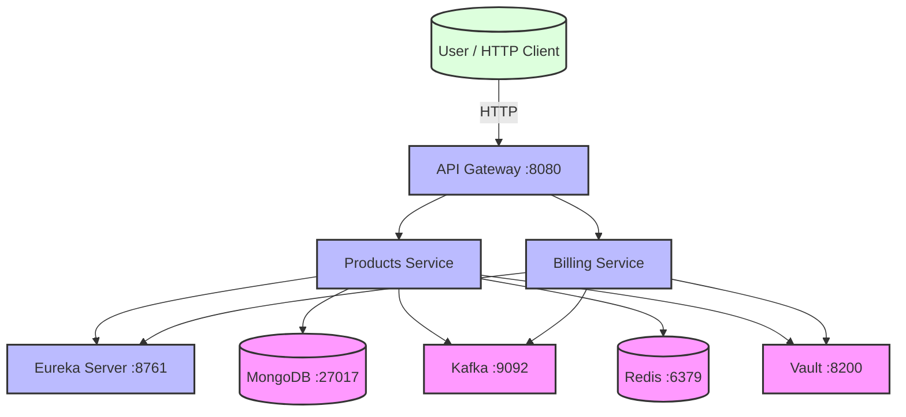
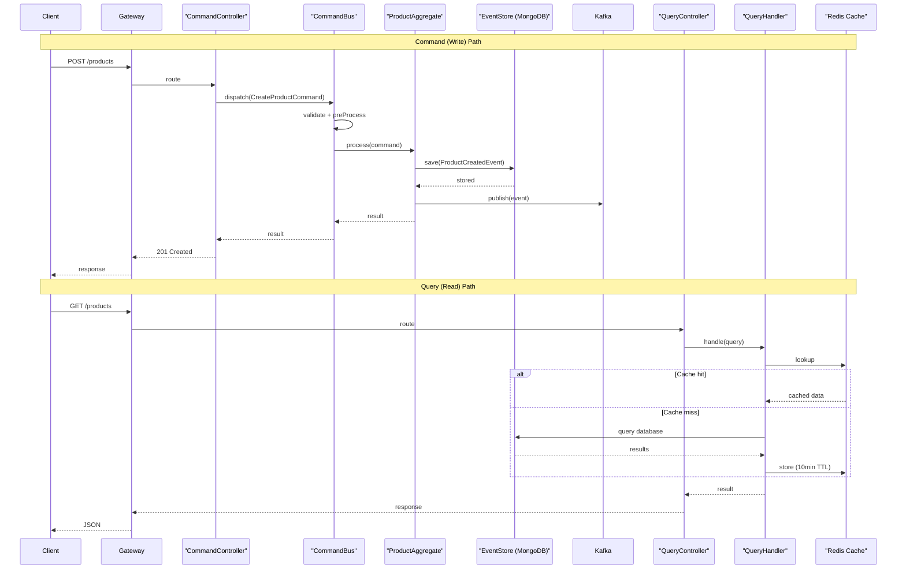
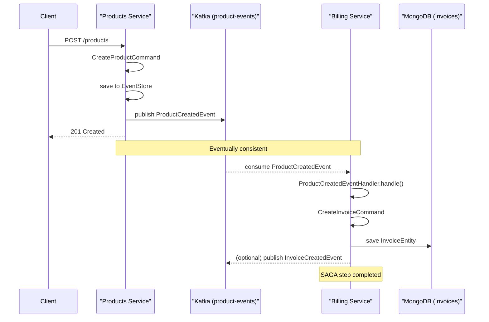
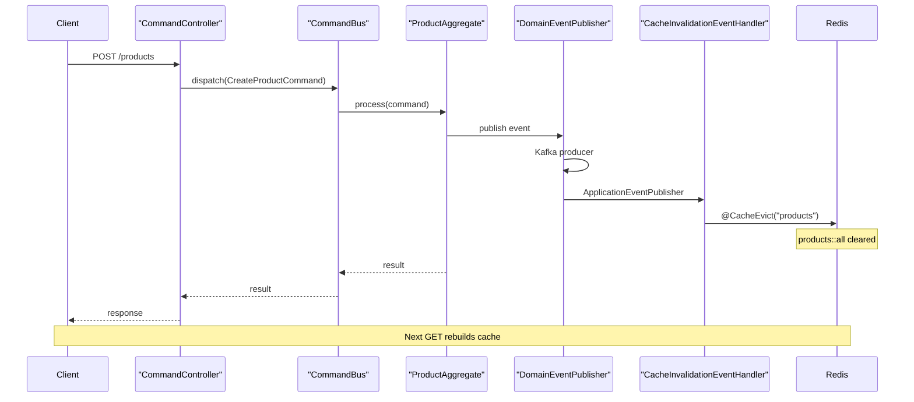

# Architecture Documentation

This microservices architecture implements **Event Sourcing**, **CQRS**, and **SAGA** patterns using Spring Cloud,
MongoDB, Kafka, and Redis with Java 21 Virtual Threads.

---

## System Context



---

## CQRS + Event Sourcing Flow



---

## SAGA Choreography (Products → Billing)



---

## Event-Driven Cache Invalidation



---

## Core Patterns

### Event Sourcing

Captures all state changes as immutable events instead of storing just current state.

**Components**: `DomainEvent` interface, `ProductCreatedEvent`, `ProductUpdatedEvent`, `EventStore`, `EventStoreEntity`

### CQRS (Command Query Responsibility Segregation)

- **Command Side** (Write): `CreateProductCommand` / `UpdateProductCommand` → Handler → Aggregate → Events
- **Query Side** (Read): `ProductQueryHandler` → Repository → Model (cached via Redis)

### Command Bus

Routes commands to registered handlers with validation and interceptor pipeline:

```
Controller → CommandBus.dispatch(command) → preProcess → Validation → Handler → postProcess → Result
```

### SAGA (Choreography)

Distributed transactions via event choreography over Kafka:

- Products publishes `ProductCreatedEvent` → Kafka `product-events` topic
- Billing consumes event → creates `Invoice`

### Event-Driven Cache Invalidation

```
Write → DomainEvent → ApplicationEventPublisher → @EventListener → @CacheEvict → Redis cleared
```

> **Note**: In-process `@EventListener` works for single-instance POC. Multi-instance production needs Kafka/Redis
> Pub/Sub for cross-instance eviction.

---

## Tech Stack

| Layer             | Technology                                |
|-------------------|-------------------------------------------|
| Framework         | Spring Boot 3.4.5 / Spring Cloud 2024.0.1 |
| Language          | Java 21 (Virtual Threads — ADR-003)       |
| Service Discovery | Netflix Eureka                            |
| API Gateway       | Spring Cloud Gateway                      |
| Database          | MongoDB 8.0                               |
| Event Streaming   | Apache Kafka 3.9.2                        |
| Cache             | Redis 7                                   |
| Secrets           | HashiCorp Vault                           |
| API Docs          | OpenAPI 3.0.3 / Swagger UI / SpringDoc    |

## ADRs

See `docs/adr/` for Architecture Decision Records:

- [ADR-001](adr/ADR-001-cqrs-event-sourcing-over-crud.md): CQRS + Event Sourcing over CRUD
- [ADR-002](adr/ADR-002-choreographed-saga-over-orchestrated.md): Choreographed SAGA
- [ADR-003](adr/ADR-003-virtual-threads-over-reactive.md): Virtual Threads over Reactive
